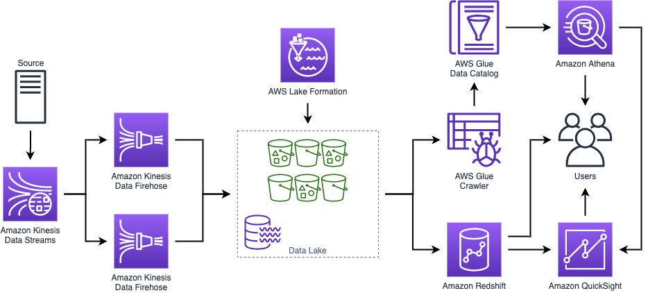

# aws-data-processing-pipeline
Data ingestion pipeline using Kinesis and S3 with querying done by Athena



## Infrastructure
Navigate to the correct directory
```
cd infra
```

Make sure NPM can build the Typescript code
```
npm run build
```

You may need to install dependencies
```
npm install -g aws-cdk
npm install @aws-cdk/aws-s3
npm install @aws-cdk/aws-kinesis
npm install @aws-cdk/aws-kinesisfirehose
npm install @aws-cdk/aws-iam
npm install @aws-cdk/aws-glue
```

Deploy CDK to provision resources using CloudFormation
```
cdk deploy
```

CDK will deploy the Kinesis and Glue components. It will not deploy Redshift, Athena, or Quicksight. Check the code for more detail.

## Sending data
Use the producer to generate 10 events per second (change the code to make this more/less frequent)
```
go run producer.go
```

Use the consumer to verify your events are hitting the Kinesis stream
```
go run consumer.go
```

## What's next
Check the CDK files (`infra/lib/cdk-stack.ts`) for how to set up a Kinesis stream with Parquet transformation.
